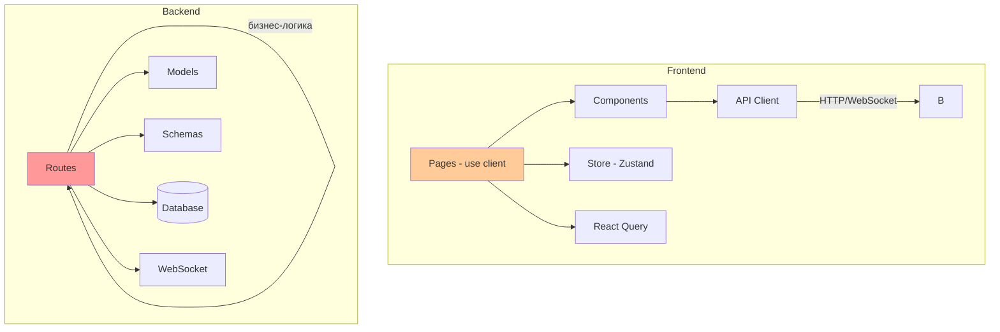
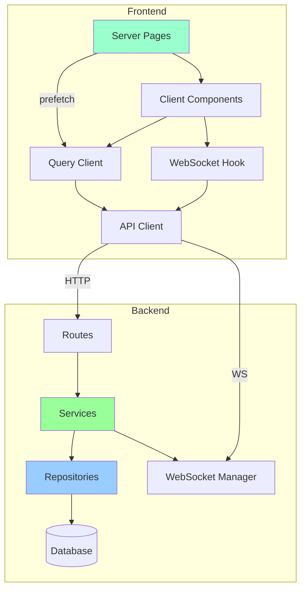

# Архитектурный анализ проекта WishShare

## Общая оценка архитектуры

Проект WishShare представляет собой full-stack приложение с разумным разделением на backend (Python/FastAPI) и frontend (Next.js/React). Архитектура в целом следует современным практикам, но имеет ряд архитектурных проблем, которые могут затруднить поддержку и масштабирование.

**Общая оценка: 6.5/10**

---

## Сильные стороны

### Backend
- ✅ **Асинхронная архитектура** - использование async/await, AsyncSession, asyncpg
- ✅ **Типизация** - Pydantic схемы для валидации, SQLAlchemy 2.0 с типизацией
- ✅ **Безопасность** - JWT токены, httponly cookies, rate limiting, CORS, CSP headers
- ✅ **Конфигурация** - pydantic-settings с переменными окружения
- ✅ **Логирование** - структурированное логирование с request_id
- ✅ **Real-time** - WebSocket для обновлений в реальном времени
- ✅ **Тесты** - наличие unit и integration тестов

### Frontend
- ✅ **Next.js 14 App Router** - современный подход к маршрутизации
- ✅ **React Query** - кэширование и управление состоянием сервера
- ✅ **Zustand** - легковесное управление клиентским состоянием
- ✅ **TypeScript** - типизация на всём frontend
- ✅ **Композиция компонентов** - разумное разделение на компоненты
- ✅ **PWA поддержка** - manifest, service worker, splash screens

---

## Проблемы и рекомендации

### Критические

#### 1. Бизнес-логика в маршрутах (God Route Files)
- **Файл**: [`backend/app/api/routes/wishlists.py`](backend/app/api/routes/wishlists.py) (~1500 строк)
- **Файл**: [`backend/app/api/routes/auth.py`](backend/app/api/routes/auth.py) (~600 строк)
- **Проблема**: Маршруты содержат бизнес-логику, сериализацию, валидацию. Нарушение Single Responsibility Principle.
- **Рекомендация**: Вынести бизнес-логику в сервисный слой:
  ```
  backend/app/
    services/
      wishlist_service.py
      gift_service.py
      auth_service.py
      reservation_service.py
  ```

#### 2. Миграции БД в коде приложения
- **Файл**: [`backend/app/main.py`](backend/app/main.py:194-286)
- **Проблема**: DDL операции (CREATE TABLE, ALTER TABLE) выполняются в startup event. Это делает миграции неконтролируемыми.
- **Рекомендация**: Использовать Alembic для всех миграций. Удалить DDL из main.py.

#### 3. Дублирование типов на Frontend
- **Файл**: [`frontend/app/wishlist/[slug]/types.ts`](frontend/app/wishlist/[slug]/types.ts)
- **Файл**: [`frontend/components/dashboard/WishlistsTab.tsx:9-21`](frontend/components/dashboard/WishlistsTab.tsx:9)
- **Проблема**: Типы `Wishlist`, `Gift` определены в нескольких местах с разными полями.
- **Рекомендация**: Создать централизованные типы:
  ```
  frontend/types/
    api.ts          # типы из backend API
    wishlist.ts     # domain типы
    user.ts
  ```

---

### Высокие

#### 4. Отсутствие сервисного слоя
- **Проблема**: Вся бизнес-логика находится в route handlers. Нет чёткого разделения между HTTP слоем и бизнес-логикой.
- **Рекомендация**: Внедрить паттерн Service Layer:
  ```python
  # backend/app/services/wishlist_service.py
  class WishlistService:
      def __init__(self, db: AsyncSession):
          self.db = db
      
      async def create_wishlist(self, data: WishlistCreate, owner: User) -> Wishlist:
          ...
      
      async def get_wishlist_with_access_check(self, slug: str, viewer: User | None) -> Wishlist:
          ...
  ```

#### 5. God File - enhanced_parser.py
- **Файл**: [`backend/app/core/enhanced_parser.py`](backend/app/core/enhanced_parser.py) (~1000 строк)
- **Проблема**: Один файл содержит парсеры для всех маркетплейсов, конфигурации, утилиты.
- **Рекомендация**: Разделить на модули:
  ```
  backend/app/parsers/
    __init__.py
    base.py              # ProductInfo, базовые классы
    og_parser.py         # Open Graph парсер
    jsonld_parser.py     # JSON-LD парсер
    playwright_parser.py # Playwright fallback
    marketplaces/
      wildberries.py
      ozon.py
      yandex.py
  ```

#### 6. Все страницы используют "use client"
- **Файл**: [`frontend/app/dashboard/page.tsx`](frontend/app/dashboard/page.tsx:1)
- **Файл**: [`frontend/app/wishlist/[slug]/page.tsx`](frontend/app/wishlist/[slug]/page.tsx:1)
- **Проблема**: Не используются Server Components Next.js 14. Теряется преимущество SSR.
- **Рекомендация**: Разделить на Server и Client компоненты:
  ```tsx
  // app/wishlist/[slug]/page.tsx (Server Component)
  export default async function WishlistPage({ params }) {
    const wishlist = await getWishlist(params.slug); // прямой fetch
    return <WishlistClient wishlist={wishlist} />;
  }
  
  // components/wishlist/WishlistClient.tsx (Client Component)
  "use client";
  export function WishlistClient({ wishlist }) { ... }
  ```

#### 7. API вызовы в компонентах
- **Файл**: [`frontend/components/wishlist/GiftCard.tsx:35-55`](frontend/components/wishlist/GiftCard.tsx:35)
- **Проблема**: Компоненты напрямую вызывают API. Нет абстракции.
- **Рекомендация**: Создать API методы:
  ```typescript
  // lib/api/gifts.ts
  export const giftsApi = {
    reserve: (id: number) => api.post(`/gifts/${id}/reserve`),
    cancelReservation: (id: number) => api.post(`/gifts/${id}/cancel-reservation`),
    delete: (id: number) => api.delete(`/gifts/${id}`),
  };
  ```

---

### Средние

#### 8. Глобальное состояние для метрик
- **Файл**: [`backend/app/main.py:47-54`](backend/app/main.py:47)
- **Проблема**: Метрики хранятся в глобальном словаре. Не работает при нескольких worker'ах.
- **Рекомендация**: Использовать Prometheus + Redis или убрать в production.

#### 9. Отсутствие Repository паттерна
- **Проблема**: SQL запросы разбросаны по route handlers. Нет абстракции над БД.
- **Рекомендация**: Внедрить Repository паттерн:
  ```python
  # backend/app/repositories/wishlist_repo.py
  class WishlistRepository:
      def __init__(self, db: AsyncSession):
          self.db = db
      
      async def get_by_slug(self, slug: str) -> Wishlist | None:
          ...
      
      async def get_with_gifts(self, slug: str) -> Wishlist | None:
          ...
  ```

#### 10. Смешивание языков в UI
- **Файл**: [`frontend/components/wishlist/GiftCard.tsx`](frontend/components/wishlist/GiftCard.tsx)
- **Проблема**: Русский текст хардкодирован в компонентах. Нет i18n.
- **Рекомендация**: Использовать next-intl или вынести в константы:
  ```typescript
  // lib/translations/ru.ts
  export const ru = {
    gift: {
      reserve: "Зарезервировать",
      cancelReservation: "Отменить резерв",
      collected: "Собрано",
    }
  };
  ```

#### 11. Отсутствие абстракции для форм
- **Проблема**: Формы без react-hook-form. Дублирование логики валидации.
- **Рекомендация**: Использовать react-hook-form + zod:
  ```typescript
  const schema = z.object({
    title: z.string().min(2).max(120),
    price: z.number().positive().optional(),
  });
  
  const { register, handleSubmit, formState: { errors } } = useForm({
    resolver: zodResolver(schema),
  });
  ```

#### 12. Зависимость от типов из app директории
- **Файл**: [`frontend/components/wishlist/GiftCard.tsx:4`](frontend/components/wishlist/GiftCard.tsx:4)
- **Проблема**: `import { Gift, User } from "../../app/wishlist/[slug]/types"` - компонент зависит от типов страницы.
- **Рекомендация**: Типы должны быть в `frontend/types/` или `frontend/lib/types/`.

---

### Низкие

#### 13. Неиспользуемый импорт ValidationError
- **Файл**: [`backend/app/schemas/auth.py:4`](backend/app/schemas/auth.py:4)
- **Проблема**: `ValidationError` импортирован, но не используется.
- **Рекомендация**: Удалить неиспользуемый импорт.

#### 14. Magic numbers
- **Файл**: [`frontend/lib/api.ts:38-39`](frontend/lib/api.ts:38)
- **Проблема**: `RETRY_BASE_MS = 300`, `MAX_RETRIES = 2` без объяснения.
- **Рекомендация**: Вынести в конфигурацию или добавить комментарии.

#### 15. Отсутствие JSDoc/TSDoc
- **Проблема**: Функции без документации. Сложно понять назначение.
- **Рекомендация**: Добавить JSDoc для публичных функций:
  ```typescript
  /**
   * Connects to wishlist WebSocket for real-time updates
   * @param slug - Wishlist slug identifier
   * @param onMessage - Callback for incoming messages
   * @returns Disconnect function
   */
  export function connectWishlistWs(slug: string, onMessage: (msg: WishlistWsMessage) => void): WishlistWsDisconnect
  ```

#### 16. Несогласованное именование файлов
- **Проблема**: `enhanced_parser.py` vs `parse_cache.py`, `ErrorBoundary.tsx` vs `error.tsx`
- **Рекомендация**: Установить конвенции именования в eslint/flake8 конфигурации.

---

## Предложения по рефакторингу

### 1. Внедрение Service Layer (Backend)

```python
# backend/app/services/__init__.py
from .wishlist_service import WishlistService
from .gift_service import GiftService
from .auth_service import AuthService

# backend/app/services/wishlist_service.py
from sqlalchemy.ext.asyncio import AsyncSession
from app.repositories.wishlist_repo import WishlistRepository
from app.schemas.wishlist import WishlistCreate, WishlistPublic

class WishlistService:
    def __init__(self, db: AsyncSession):
        self.repo = WishlistRepository(db)
    
    async def create(self, data: WishlistCreate, owner_id: int) -> WishlistPublic:
        # Бизнес-логика создания вишлиста
        wishlist = await self.repo.create(data, owner_id)
        return WishlistPublic.model_validate(wishlist)
    
    async def get_with_access_check(
        self, 
        slug: str, 
        viewer_id: int | None,
        viewer_email: str | None
    ) -> WishlistPublic | None:
        wishlist = await self.repo.get_by_slug(slug)
        if not wishlist:
            return None
        
        # Проверка доступа вынесена в отдельный метод
        if not self._check_access(wishlist, viewer_id, viewer_email):
            return None
        
        return self._serialize(wishlist, viewer_id)
```

### 2. Разделение парсеров (Backend)

```python
# backend/app/parsers/base.py
from dataclasses import dataclass
from typing import Protocol

@dataclass
class ProductInfo:
    title: str | None = None
    price: float | None = None
    image_url: str | None = None
    ...

class MarketplaceParser(Protocol):
    domains: list[str]
    
    async def parse(self, url: str, html: str) -> ProductInfo | None:
        ...

# backend/app/parsers/marketplaces/wildberries.py
class WildberriesParser:
    domains = ["wildberries.ru", "wb.ru"]
    
    async def parse(self, url: str, html: str) -> ProductInfo | None:
        # Парсинг Wildberries
        ...
```

### 3. Централизованные типы (Frontend)

```typescript
// frontend/types/api.ts
export interface User {
  id: number;
  email: string;
  name: string;
  avatar_url: string | null;
  created_at: string;
}

export interface Wishlist {
  id: number;
  slug: string;
  title: string;
  description: string | null;
  event_date: string | null;
  privacy: "public" | "link_only" | "friends";
  is_secret_santa: boolean;
  owner_id: number;
  gifts: Gift[];
  public_token: string | null;
}

export interface Gift {
  id: number;
  title: string;
  url: string | null;
  price: number | null;
  image_url: string | null;
  is_collective: boolean;
  is_private: boolean;
  is_reserved: boolean;
  reservation: Reservation | null;
  contributions: Contribution[];
  total_contributions: number;
  collected_percent: number;
  is_fully_collected: boolean;
}
```

### 4. Server Components (Frontend)

```tsx
// app/wishlist/[slug]/page.tsx
import { dehydrate, QueryClient } from "@tanstack/react-query";
import { WishlistClient } from "./WishlistClient";

async function getWishlist(slug: string) {
  const res = await fetch(`${process.env.BACKEND_URL}/wishlists/${slug}`, {
    cache: "no-store",
  });
  if (!res.ok) return null;
  return res.json();
}

export default async function WishlistPage({ params }: { params: { slug: string } }) {
  const wishlist = await getWishlist(params.slug);
  
  if (!wishlist) {
    return <WishlistNotFound />;
  }
  
  return <WishlistClient initialData={wishlist} />;
}

// app/wishlist/[slug]/WishlistClient.tsx
"use client";

import { useQuery } from "@tanstack/react-query";

export function WishlistClient({ initialData }: { initialData: Wishlist }) {
  const { data: wishlist } = useQuery({
    queryKey: ["wishlist", initialData.slug],
    initialData,
  });
  
  // WebSocket и интерактивность
  return <WishlistView wishlist={wishlist} />;
}
```

---

## Диаграмма текущей архитектуры



## Диаграмма целевой архитектуры



---

## Приоритетный план улучшений

1. **Неделя 1-2**: Вынести бизнес-логику в сервисный слой (критично для поддержки)
2. **Неделя 3**: Разделить enhanced_parser.py на модули
3. **Неделя 4**: Создать централизованные типы на frontend
4. **Неделя 5-6**: Постепенный переход на Server Components
5. **Неделя 7**: Внедрить Repository паттерн
6. **Неделя 8**: Добавить i18n поддержку

---

*Анализ выполнен: 2026-02-24*
